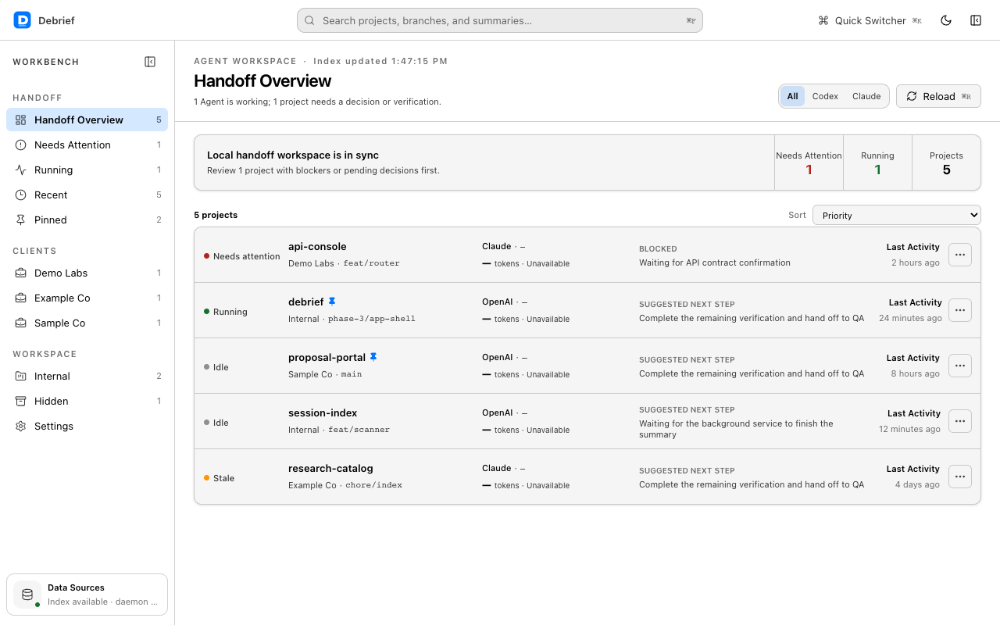
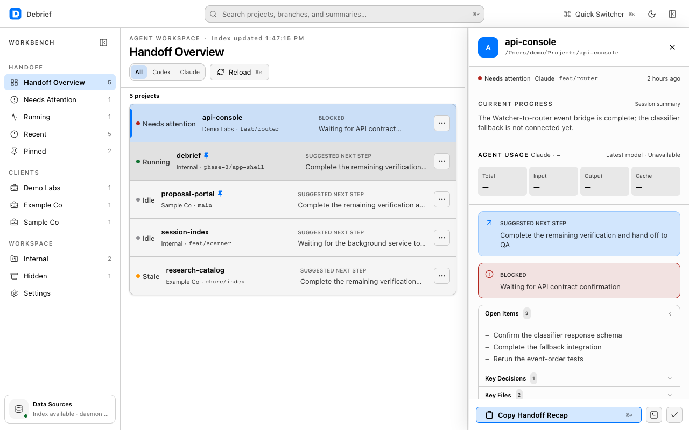
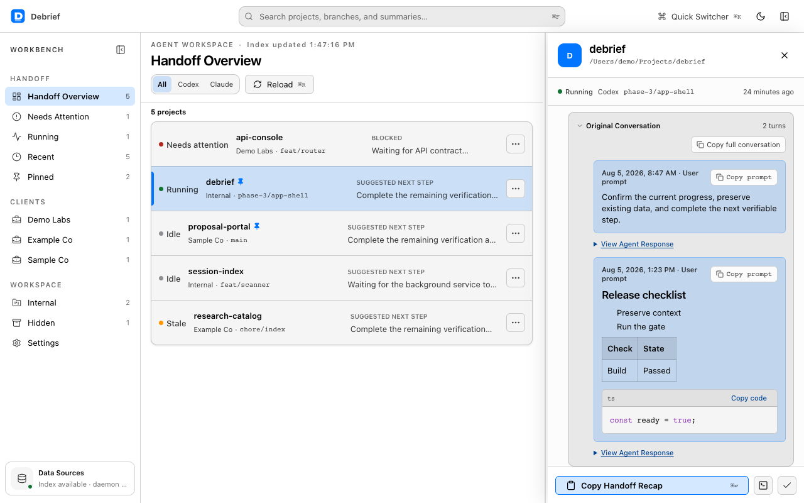

[English](./README.md) | [繁體中文](./README.zh-TW.md) | [简体中文](./README.zh-CN.md)

<!-- README_PARITY_VERSION: 0.1.0-alpha.rc1 -->

<div align="center">

# RunDebrief

### Know what every coding agent did. Pick up exactly where it left off.

The open-source continuity layer for coding agents.

**macOS alpha · Claude Code + Codex · Apache-2.0**

[Repository](https://github.com/tentenco/RunDebrief) · [Issues](https://github.com/tentenco/RunDebrief/issues) · [Security](https://github.com/tentenco/RunDebrief/security) · [Releases](https://github.com/tentenco/RunDebrief/releases)

</div>

> **Release status:** RunDebrief is open source. `v0.1.0-alpha` is the binary release candidate, and there is no signed or notarized installer yet. Do not download or redistribute an unofficial binary.

> **Naming note:** RunDebrief is the public working name. The app and internal package identifiers still use `Debrief` until a separately reviewed migration is approved.



## Why RunDebrief

Coding agents can finish substantial work, but their context is often scattered across terminal tabs, provider-specific histories, and long JSONL transcripts.

RunDebrief turns supported local histories into a project-first handoff: what changed, what is blocked, which files matter, what should happen next, and the original turns behind the summary. It can observe supported sessions even when it did not start them.

It is not an editor, terminal, agent launcher, or remote-control bypass. Its job is continuity and inspectable evidence while preserving the permission model of the underlying agent.

## What works today

The current alpha is a macOS desktop app built with Tauri, React, TypeScript, Rust, and SQLite.

- Discover local Claude Code and Codex histories without modifying them.
- Organize runs by project, provider, recency, and detected runtime state.
- Review summaries, blockers, next steps, key files, and usage evidence.
- Inspect the latest original user and assistant turns behind a summary.
- Search, filter, sort, pin, hide, rename, acknowledge, and reopen work.
- Use a deterministic local fallback when no AI summary gateway is configured.
- Use the app interface in English, Traditional Chinese, or Simplified Chinese, with light and dark themes.

<table>
  <tr>
    <td width="50%"></td>
    <td width="50%"></td>
  </tr>
</table>

## Privacy and network boundaries

RunDebrief treats `~/.claude` and `~/.codex` as read-only source histories. Its incremental scanner stores a separate local SQLite index and does not rewrite source transcripts.

AI summarization is an explicit network boundary. When `gatewayUrl` and a model are configured in `~/.debrief/config.json`, selected run content can be sent to that user-configured OpenAI-compatible gateway. With no gateway configured, ended sessions use a deterministic local fallback and no summary request is made.

The current daemon also supports an optional Mem0-compatible write-back only when both `DEBRIEF_MEM0_URL` and `DEBRIEF_MEM0_USER_ID` are explicitly configured. `DEBRIEF_MEM0_KEY` is an optional credential. Outbound metadata contains project name, session ID, and source—not the absolute project path—and summary text redacts detected absolute project roots. Leave either required setting unset to disable write-back.

RunDebrief has no silent analytics or hosted synchronization in this alpha. Review [SECURITY.md](https://github.com/tentenco/RunDebrief/blob/main/SECURITY.md) before using real work histories.

## Known alpha limitations

- macOS only; Windows and Linux builds have not shipped.
- No signed or notarized public binary exists yet.
- Claude Code and Codex are the only supported history adapters.
- The app UI supports English, Traditional Chinese, and Simplified Chinese; other UI languages are not included.
- No iOS app, hosted sync, push notification, approval flow, or remote prompting exists yet.
- Summaries can be incomplete or wrong; inspect source evidence, code, diffs, and tests.
- A Developer ID-signed and Apple-notarized installer remains the outstanding binary-distribution gate.

## Release status and installation

The canonical release page will be [GitHub Releases](https://github.com/tentenco/RunDebrief/releases). Until a release contains a Developer ID-signed, Apple-notarized DMG plus SHA-256 checksums, build from source or wait. Gatekeeper bypass instructions are not supported.

### Requirements

- macOS 12 or newer
- Node.js 22.13 or newer
- Corepack and pnpm 11.3.0
- Rust stable
- Xcode Command Line Tools and the Tauri v2 macOS prerequisites
- `sqlite3` CLI for diagnostics

### Build from source

```bash
git clone https://github.com/tentenco/RunDebrief.git
cd RunDebrief
corepack enable
corepack prepare pnpm@11.3.0 --activate
pnpm install --frozen-lockfile
pnpm build
pnpm build:landing
pnpm test
pnpm debrief scan
pnpm --filter @debrief/app tauri dev
```

`pnpm debrief scan` reads supported local histories and writes the separate local index under `~/.debrief/`. Review the code and privacy boundaries before running it against real data.

### Optional summary configuration

Create `~/.debrief/config.json` at runtime. Never commit this file.

```json
{
  "gatewayUrl": "https://your-openai-compatible-gateway.example/v1",
  "gatewayKey": "your-runtime-secret",
  "summaryModel": "your-model",
  "editorCmd": "code",
  "terminalApp": "Terminal"
}
```

Without `gatewayUrl`, RunDebrief does not make an AI summary request and uses its deterministic fallback for ended sessions.

## Architecture

```text
~/.claude + ~/.codex (read-only)
              │
              ▼
      adapters + incremental scanner
              │
              ▼
       local SQLite index ─────► Tauri desktop app
              │
              ├────► configured gateway (optional summaries)
              └────► configured Mem0 endpoint (optional write-back)
```

- `packages/core` — adapters, incremental parsing, schema, and local index.
- `packages/daemon` — watcher, runtime detection, summarization, fallback, and launchd integration.
- `packages/app` — Tauri v2 desktop interface.
- `packages/landing` — public product and open-source launch site.

The launch daemon owns only `com.tenten.debrief-daemon`; it must not modify other launchd jobs.

## Roadmap

### Now

- Keep the public source export, secret scan, and privacy checks green.
- Verify source onboarding in a clean macOS account.
- Complete Developer ID signing, notarization, checksums, and a draft prerelease.
- Maintain GitHub private vulnerability reporting for confidential security intake.

### Next

- Improve handoff and search quality with real-user feedback.
- Publish an adapter contract with synthetic fixtures.
- Add providers based on demonstrated demand.
- Add exportable evidence-backed handoffs.

### Later

- Validate a read-only mobile attention surface.
- Design identity, encrypted transport, revocation, and audit history before any remote action.
- Preserve the underlying agent's permission model for every future continuation feature.

The roadmap is directional, not a commitment.

## Contributing and security

Read [CONTRIBUTING.md](https://github.com/tentenco/RunDebrief/blob/main/CONTRIBUTING.md) and [CODE_OF_CONDUCT.md](https://github.com/tentenco/RunDebrief/blob/main/CODE_OF_CONDUCT.md) before opening a change. Use [GitHub Issues](https://github.com/tentenco/RunDebrief/issues) for non-security reports.

Do not submit real transcripts, credentials, customer names, private repository identifiers, usernames, or full machine paths. Use synthetic or anonymized fixtures only.

Security reports must use [GitHub private vulnerability reporting](https://github.com/tentenco/RunDebrief/security/advisories/new). Do not publish exploit details in an issue.

## Built by Tenten

RunDebrief is an open-source product experiment by [Tenten](https://tenten.co/) at the intersection of AI, software, and product design. It is not affiliated with or endorsed by Anthropic or OpenAI; their names and marks belong to their respective owners.

## License

Source code is licensed under the [Apache License 2.0](./LICENSE). It permits commercial use and modification and includes an explicit patent grant. The license does not grant rights to imply endorsement or use Tenten project marks beyond reasonable attribution; see [TRADEMARKS.md](./TRADEMARKS.md).
