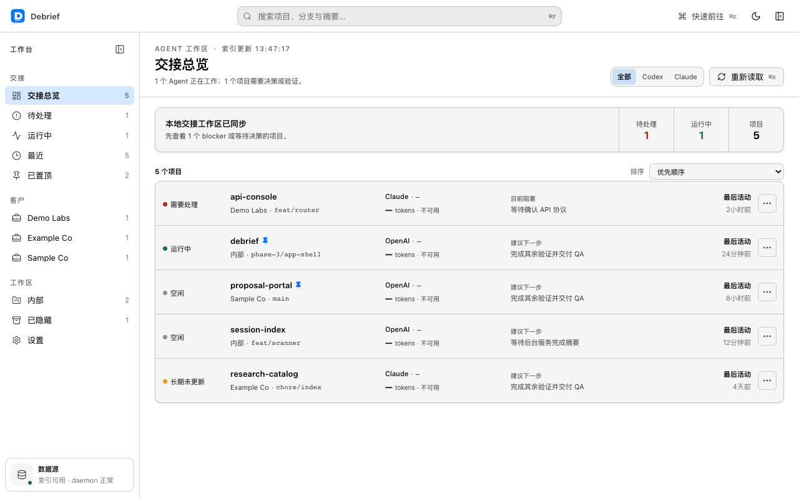
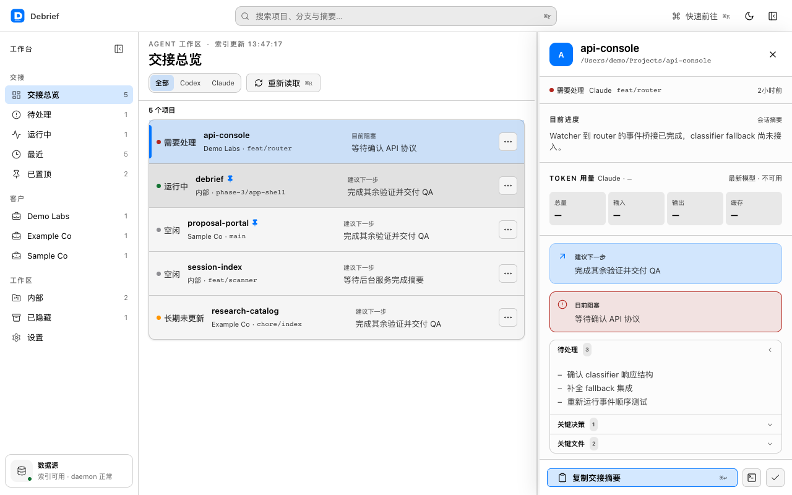
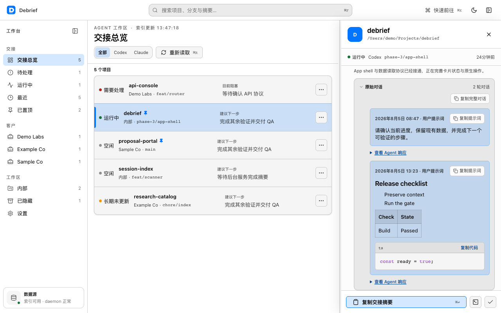

[English](./README.md) | [繁體中文](./README.zh-TW.md) | [简体中文](./README.zh-CN.md)

<!-- README_PARITY_VERSION: 0.1.0-alpha.rc1 -->

<div align="center">

# RunDebrief

### 掌握每个编程 Agent 做了什么，准确接续未完成的工作。

面向编程 Agent 的开源工作接续层。

**macOS alpha · Claude Code + Codex · Apache-2.0**

[代码仓库](https://github.com/tentenco/RunDebrief) · [Issues](https://github.com/tentenco/RunDebrief/issues) · [安全](https://github.com/tentenco/RunDebrief/security) · [Releases](https://github.com/tentenco/RunDebrief/releases)

</div>

> **发布状态：** RunDebrief 现已开源。`v0.1.0-alpha` 是 binary release candidate，目前还没有完成签名与 Apple 公证的安装包。请勿下载或转发非官方 binary。

> **命名说明：** RunDebrief 是目前的公开工作名称。App 与内部 package identifier 仍使用 `Debrief`；除非另有经过审查的迁移方案，否则不会擅自更改。



## 为什么需要 RunDebrief

编程 Agent 可以完成大量工作，但上下文往往散落在终端标签页、各家提供商的历史记录，以及冗长的 JSONL transcript 中。

RunDebrief 将受支持的本地历史整理为以项目为中心的 handoff：做了哪些改动、卡在哪里、哪些文件重要、下一步是什么，以及摘要背后的原始对话。即使 session 不是由 RunDebrief 启动，只要格式受到支持，它仍然可以观察并整理。

它不是编辑器、终端、Agent launcher，也不是绕过权限的远程控制工具。它的职责是在保留底层 Agent 权限模型的前提下，提供可核验的证据与工作接续能力。

## 当前可用功能

当前 alpha 是使用 Tauri、React、TypeScript、Rust 与 SQLite 构建的 macOS 桌面 App。

- 发现本地 Claude Code 与 Codex 历史，而不修改原始文件。
- 按项目、提供商、时间和检测到的 runtime 状态整理工作。
- 查看摘要、阻塞项、下一步、关键文件与 token 使用证据。
- 查看摘要背后最新的原始 user／assistant turns。
- 搜索、筛选、排序、置顶、隐藏、重命名、确认处理并重新打开工作。
- 未配置 AI summary gateway 时，使用 deterministic local fallback。
- App 界面支持 English、繁体中文与简体中文，并提供浅色／深色主题。

<table>
  <tr>
    <td width="50%"></td>
    <td width="50%"></td>
  </tr>
</table>

## 隐私与网络边界

RunDebrief 将 `~/.claude` 与 `~/.codex` 视为只读的来源历史。Incremental scanner 会建立独立的本地 SQLite index，不会重写来源 transcript。

AI 摘要是明确的网络边界。当 `~/.debrief/config.json` 配置了 `gatewayUrl` 与模型时，选取的 run 内容可能发送到用户指定、兼容 OpenAI API 的 gateway。未配置 gateway 时，已结束的 session 会使用 deterministic local fallback，且不会发起摘要网络请求。

当前 daemon 也支持可选的 Mem0-compatible write-back，但只有同时明确配置 `DEBRIEF_MEM0_URL` 与 `DEBRIEF_MEM0_USER_ID` 才会启用；`DEBRIEF_MEM0_KEY` 是可选 credential。Outbound metadata 只包含项目名称、session ID 与 source，不包含 absolute project path；摘要文本也会 redact 检测到的 absolute project root。任一必需配置缺失时，write-back 即禁用。

此 alpha 没有隐性 analytics 或 hosted synchronization。把真实工作历史交给本 App 前，请先阅读 [SECURITY.md](https://github.com/tentenco/RunDebrief/blob/main/SECURITY.md)。

## Alpha 已知限制

- 仅支持 macOS；Windows 与 Linux build 尚未发布。
- 尚无完成签名与 Apple 公证的公开 binary。
- 当前仅支持 Claude Code 与 Codex 两种历史 adapter。
- App UI 支持 English、繁体中文与简体中文，尚未提供其他语言。
- 尚无 iOS App、hosted sync、push notification、approval flow 或 remote prompting。
- 摘要可能不完整或错误；仍须检查来源证据、代码、diff 与测试。
- Developer ID 签名与 Apple 公证的安装包，仍是 binary distribution 尚待完成的 gate。

## 发布状态与安装

正式安装包只会出现在 [GitHub Releases](https://github.com/tentenco/RunDebrief/releases)。在 Release 具备 Developer ID 签名、Apple 公证的 DMG 与 SHA-256 checksums 前，请从源代码构建或等待正式版本。本项目不提供绕过 Gatekeeper 的操作方式。

### 环境要求

- macOS 12 或更新版本
- Node.js 22.13 或更新版本
- Corepack 与 pnpm 11.3.0
- Rust stable
- Xcode Command Line Tools 与 Tauri v2 的 macOS prerequisites
- 用于诊断的 `sqlite3` CLI

### 从源代码构建

```bash
git clone https://github.com/tentenco/RunDebrief.git
cd RunDebrief
corepack enable
corepack prepare pnpm@11.3.0 --activate
pnpm install --frozen-lockfile
pnpm build
pnpm build:landing
pnpm test
pnpm debrief scan
pnpm --filter @debrief/app tauri dev
```

`pnpm debrief scan` 会读取受支持的本地历史，并将独立 index 写入 `~/.debrief/`。对真实数据运行前，请先审阅代码与隐私边界。

### 可选的摘要配置

在 runtime 创建 `~/.debrief/config.json`，切勿将此文件 commit 到 Git。

```json
{
  "gatewayUrl": "https://your-openai-compatible-gateway.example/v1",
  "gatewayKey": "your-runtime-secret",
  "summaryModel": "your-model",
  "editorCmd": "code",
  "terminalApp": "Terminal"
}
```

未设置 `gatewayUrl` 时，RunDebrief 不会发起 AI 摘要请求；已结束的 session 会使用 deterministic fallback。

## 架构

```text
~/.claude + ~/.codex (read-only)
              │
              ▼
      adapters + incremental scanner
              │
              ▼
       local SQLite index ─────► Tauri desktop app
              │
              ├────► configured gateway (optional summaries)
              └────► configured Mem0 endpoint (optional write-back)
```

- `packages/core` — adapters、incremental parsing、schema 与本地 index。
- `packages/daemon` — watcher、runtime detection、summarization、fallback 与 launchd integration。
- `packages/app` — Tauri v2 桌面界面。
- `packages/landing` — 公开产品与开源发布网站。

Launch daemon 只管理 `com.tenten.debrief-daemon`，不得修改其他 launchd jobs。

## Roadmap

### 现在

- 持续保持 public source export、secret scan 与 privacy checks 为绿色状态。
- 在干净的 macOS 账户验证 source onboarding。
- 完成 Developer ID 签名、Apple 公证、checksums 与 draft prerelease。
- 维持 GitHub private vulnerability reporting，用于机密安全问题。

### 下一步

- 通过真实用户反馈提升 handoff 与搜索质量。
- 发布带有 synthetic fixtures 的 adapter contract。
- 按经过验证的需求增加提供商。
- 加入可导出的 evidence-backed handoff。

### 以后

- 验证只读的移动端 attention surface。
- 在任何 remote action 前完成 identity、encrypted transport、revocation 与 audit history 设计。
- 所有未来 continuation 功能都必须保留底层 Agent 的权限模型。

Roadmap 只表示方向，不是交付承诺。

## 贡献与安全

提交改动前，请阅读 [CONTRIBUTING.md](https://github.com/tentenco/RunDebrief/blob/main/CONTRIBUTING.md) 与 [CODE_OF_CONDUCT.md](https://github.com/tentenco/RunDebrief/blob/main/CODE_OF_CONDUCT.md)。非安全问题请使用 [GitHub Issues](https://github.com/tentenco/RunDebrief/issues)。

请勿提交真实 transcript、credentials、客户名称、私有 repository identifier、用户名或完整机器路径；fixtures 只能使用 synthetic 或 anonymized 内容。

安全问题必须使用 [GitHub private vulnerability reporting](https://github.com/tentenco/RunDebrief/security/advisories/new)。请勿在公开 issue 中发布漏洞细节。

## 由 Tenten 打造

RunDebrief 是 [Tenten](https://tenten.co/) 在 AI、软件与产品设计交汇处进行的开源产品实验。本项目与 Anthropic 或 OpenAI 没有隶属或背书关系；相关名称与商标分别属于其权利人。

## 许可证

源代码采用 [Apache License 2.0](./LICENSE)。该许可证允许商业使用与修改，并包含明确的专利授权；但不允许暗示官方背书，也不授权在合理标明来源之外使用 Tenten 项目标志。详情请参阅 [TRADEMARKS.md](./TRADEMARKS.md)。
