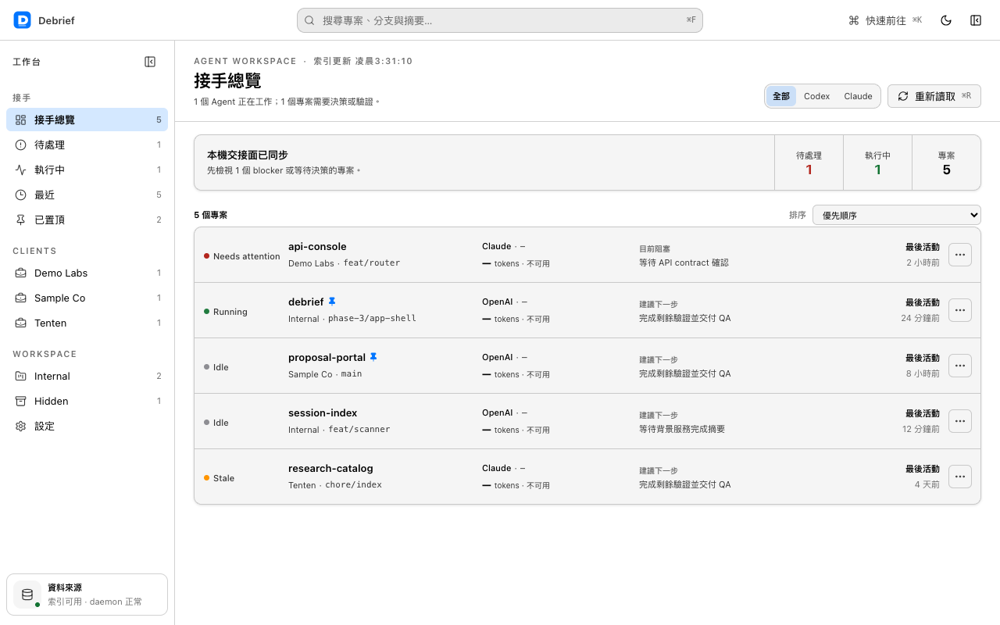
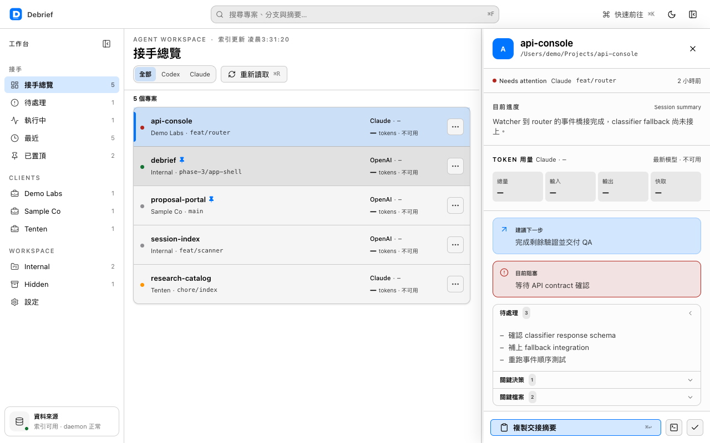
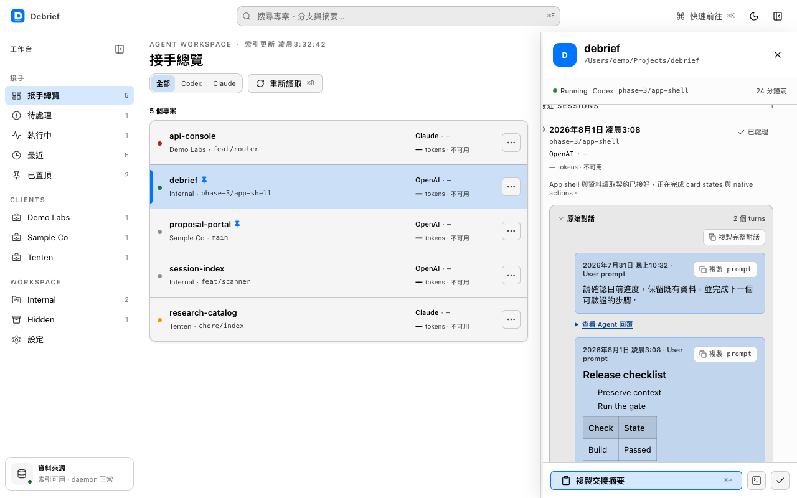

[English](./README.md) | [繁體中文](./README.zh-TW.md) | [简体中文](./README.zh-CN.md)

<!-- README_PARITY_VERSION: 0.1.0-alpha.rc1 -->

<div align="center">

# RunDebrief

### 掌握每個程式開發 Agent 做了什麼，精準接續未完工作。

專為程式開發 Agent 打造的開源工作續接層。

**macOS alpha · Claude Code + Codex · Apache-2.0**

[原始碼庫](https://github.com/tentenco/RunDebrief) · [Issues](https://github.com/tentenco/RunDebrief/issues) · [安全性](https://github.com/tentenco/RunDebrief/security) · [Releases](https://github.com/tentenco/RunDebrief/releases)

</div>

> **發布狀態：** RunDebrief 現已開源。`v0.1.0-alpha` 是 binary release candidate，目前還沒有完成簽章與 Apple 公證的安裝檔。請勿下載或轉傳非官方 binary。

> **命名說明：** RunDebrief 是目前的公開工作名稱。App 與內部 package identifier 仍使用 `Debrief`，除非另有經審核通過的遷移計畫，否則不會逕自更改。



## 為什麼需要 RunDebrief

程式開發 Agent 可以完成大量工作，但脈絡往往散落在 Terminal 分頁、各家供應商的歷史記錄，以及冗長的 JSONL transcript 裡。

RunDebrief 將支援的本機歷史整理成以專案為核心的 handoff：做了哪些變更、卡在哪裡、哪些檔案重要、下一步是什麼，以及摘要背後的原始對話。即使 session 不是由 RunDebrief 啟動，只要格式受到支援，它仍可觀察與整理。

它不是編輯器、Terminal、Agent launcher，也不是繞過權限的遠端控制工具。它的任務是在保留底層 Agent 權限模型的前提下，提供可查證的證據與工作續接能力。

## 目前可用功能

目前的 alpha 是以 Tauri、React、TypeScript、Rust 與 SQLite 建構的 macOS 桌面 App。

- 探索本機 Claude Code 與 Codex 歷史，不修改原始檔案。
- 依專案、供應商、時間與偵測到的 runtime 狀態整理工作。
- 檢視摘要、阻塞事項、下一步、關鍵檔案與 token 使用證據。
- 查看摘要背後最新的原始 user／assistant turns。
- 搜尋、篩選、排序、置頂、隱藏、重新命名、標記處理與重開工作。
- 未設定 AI summary gateway 時，使用 deterministic local fallback。
- App 介面支援 English 與繁體中文，並提供明／暗色主題。

App 介面目前**不支援簡體中文**；簡體中文 README 只提供文件翻譯。

<table>
  <tr>
    <td width="50%"></td>
    <td width="50%"></td>
  </tr>
</table>

## 隱私與網路邊界

RunDebrief 將 `~/.claude` 與 `~/.codex` 視為唯讀的來源歷史。Incremental scanner 會建立獨立的本機 SQLite index，不會重寫來源 transcript。

AI 摘要是明確的網路邊界。當 `~/.debrief/config.json` 設定了 `gatewayUrl` 與模型時，選取的 run 內容可能送到使用者指定、相容 OpenAI API 的 gateway。未設定 gateway 時，已結束的 session 會使用 deterministic local fallback，且不會提出摘要網路請求。

目前 daemon 也支援選用的 Mem0-compatible write-back，但只有同時明確設定 `DEBRIEF_MEM0_URL` 與 `DEBRIEF_MEM0_USER_ID` 才會啟用；`DEBRIEF_MEM0_KEY` 是選用的 credential。Outbound metadata 只包含專案名稱、session ID 與 source，不包含 absolute project path；摘要文字也會 redact 偵測到的 absolute project root。任一必要設定未提供時，write-back 即停用。

此 alpha 沒有隱性 analytics 或 hosted synchronization。將真實工作歷史交給本 App 前，請先閱讀 [SECURITY.md](https://github.com/tentenco/RunDebrief/blob/main/SECURITY.md)。

## Alpha 已知限制

- 僅支援 macOS；Windows 與 Linux build 尚未發布。
- 尚無完成簽章與 Apple 公證的公開 binary。
- 目前只支援 Claude Code 與 Codex 兩種歷史 adapter。
- App UI 支援 English 與繁體中文，不支援簡體中文。
- 尚無 iOS App、hosted sync、push notification、approval flow 或 remote prompting。
- 摘要可能不完整或錯誤；仍須檢查來源證據、程式碼、diff 與測試。
- Developer ID 簽章與 Apple 公證的安裝檔，仍是 binary distribution 尚待完成的 gate。

## 發布狀態與安裝

正式安裝檔只會出現在 [GitHub Releases](https://github.com/tentenco/RunDebrief/releases)。在 Release 具備 Developer ID 簽章、Apple 公證的 DMG 與 SHA-256 checksums 前，請從原始碼建置或等待正式版本。本專案不提供繞過 Gatekeeper 的操作方式。

### 環境需求

- macOS 12 或更新版本
- Node.js 22.13 或更新版本
- Corepack 與 pnpm 11.3.0
- Rust stable
- Xcode Command Line Tools 與 Tauri v2 的 macOS prerequisites
- 用於診斷的 `sqlite3` CLI

### 從原始碼建置

```bash
git clone https://github.com/tentenco/RunDebrief.git
cd RunDebrief
corepack enable
corepack prepare pnpm@11.3.0 --activate
pnpm install --frozen-lockfile
pnpm build
pnpm build:landing
pnpm test
pnpm debrief scan
pnpm --filter @debrief/app tauri dev
```

`pnpm debrief scan` 會讀取支援的本機歷史，並將獨立 index 寫入 `~/.debrief/`。對真實資料執行前，請先審閱程式碼與隱私邊界。

### 選用的摘要設定

在 runtime 建立 `~/.debrief/config.json`，切勿將此檔案 commit 進 Git。

```json
{
  "gatewayUrl": "https://your-openai-compatible-gateway.example/v1",
  "gatewayKey": "your-runtime-secret",
  "summaryModel": "your-model",
  "editorCmd": "code",
  "terminalApp": "Terminal"
}
```

未設定 `gatewayUrl` 時，RunDebrief 不會提出 AI 摘要請求；已結束的 session 會使用 deterministic fallback。

## 架構

```text
~/.claude + ~/.codex (read-only)
              │
              ▼
      adapters + incremental scanner
              │
              ▼
       local SQLite index ─────► Tauri desktop app
              │
              ├────► configured gateway (optional summaries)
              └────► configured Mem0 endpoint (optional write-back)
```

- `packages/core` — adapters、incremental parsing、schema 與本機 index。
- `packages/daemon` — watcher、runtime detection、summarization、fallback 與 launchd integration。
- `packages/app` — Tauri v2 桌面介面。
- `packages/landing` — 公開產品與開源發布網站。

Launch daemon 只管理 `com.tenten.debrief-daemon`，不得修改其他 launchd jobs。

## Roadmap

### 現在

- 持續維持 public source export、secret scan 與 privacy checks 為綠燈。
- 在乾淨的 macOS 帳號驗證 source onboarding。
- 完成 Developer ID 簽章、Apple 公證、checksums 與 draft prerelease。
- 維持 GitHub private vulnerability reporting，供機密安全問題使用。

### 下一步

- 透過真實使用者回饋提升 handoff 與搜尋品質。
- 發布搭配 synthetic fixtures 的 adapter contract。
- 依經證實的需求增加供應商。
- 加入可匯出的 evidence-backed handoff。

### 未來

- 驗證唯讀的行動版 attention surface。
- 在任何 remote action 前先完成 identity、encrypted transport、revocation 與 audit history 設計。
- 所有未來 continuation 功能都必須保留底層 Agent 的權限模型。

Roadmap 只代表方向，不是交付承諾。

## 貢獻與安全性

提出變更前，請閱讀 [CONTRIBUTING.md](https://github.com/tentenco/RunDebrief/blob/main/CONTRIBUTING.md) 與 [CODE_OF_CONDUCT.md](https://github.com/tentenco/RunDebrief/blob/main/CODE_OF_CONDUCT.md)。非安全性問題請使用 [GitHub Issues](https://github.com/tentenco/RunDebrief/issues)。

請勿提交真實 transcript、credentials、客戶名稱、私有 repository identifier、使用者名稱或完整機器路徑；fixtures 只能使用 synthetic 或 anonymized 內容。

安全性問題必須使用 [GitHub private vulnerability reporting](https://github.com/tentenco/RunDebrief/security/advisories/new)。請勿在公開 issue 張貼漏洞細節。

## 由 Tenten 打造

RunDebrief 是 [Tenten](https://tenten.co/) 在 AI、軟體與產品設計交會處進行的開源產品實驗。本專案與 Anthropic 或 OpenAI 沒有隸屬或背書關係；相關名稱與商標分別屬於其權利人。

## 授權

原始碼採用 [Apache License 2.0](./LICENSE)。此授權允許商業使用與修改，並包含明確的專利授權；但不允許暗示官方背書，也不授權在合理標示來源以外使用 Tenten 專案標誌。詳情請參閱 [TRADEMARKS.md](./TRADEMARKS.md)。
